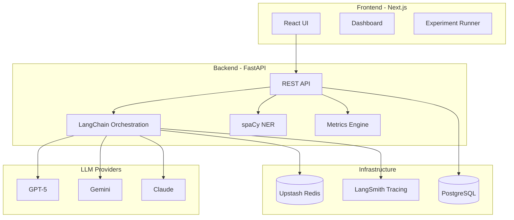

# AI Rank & Influence Tracker - Complete Project Documentation

## 🎯 Project Overview

The **AI Rank & Influence Tracker** is a sophisticated measurement and optimization platform designed to monitor and improve brand visibility in Large Language Models (LLMs) like GPT-5, Gemini, and Claude. It provides actionable insights for increasing brand recall through strategic PR, content optimization, and structured data management.

## 🏗️ Architecture



## 🚀 Key Features

### 1. **Brand Visibility Measurement**
- **B→E (Brand-to-Entities)**: Discovers what concepts, products, and competitors are associated with your brand
- **E→B (Entities-to-Brand)**: Identifies which brands LLMs associate with specific categories
- **Mention Rate**: Percentage of responses containing your brand
- **Average Rank**: Mean position when brand appears in lists
- **Weighted Score**: Combined metric for executive reporting

### 2. **Multi-Model Support**
- **OpenAI GPT-5**: Latest model with enhanced capabilities
- **Google Gemini**: Google's advanced LLM
- **Anthropic Claude**: Anthropic's constitutional AI
- All integrated via **LangChain** for consistent orchestration

### 3. **Grounded vs Ungrounded Analysis**
- **Grounded Mode**: Model uses external data retrieval
- **Ungrounded Mode**: Model answers from internal weights only
- **Gap Analysis**: Identifies whether to focus on entity grounding (Wikipedia, Wikidata) or content/PR

### 4. **Entity Normalization System**
- **Smart Aliasing**: Maps "Avea", "Avea Life", "Avea AG" → single brand entity
- **spaCy NER**: Extracts organizations, products, and persons
- **Brand Cache**: Fast lookup for known brand variations
- **Collision Handling**: Prevents false matches for common names

### 5. **Google-Aligned Embeddings**
```python
def google_similarity(vec_a, vec_b):
    # Normalize vectors (unit length)
    norm_a = vec_a / np.linalg.norm(vec_a)
    norm_b = vec_b / np.linalg.norm(vec_b)
    # Dot product = cosine similarity for unit vectors
    return np.dot(norm_a, norm_b)
```

### 6. **LangSmith Integration**
- Full tracing of all LLM calls
- Token usage monitoring
- Latency analysis
- Cost tracking
- Debug capabilities

### 7. **Upstash Redis Caching**
- Response caching with `airanker:` prefix
- Shared Redis instance support
- 24-hour cache TTL
- Reduced API costs

## 📊 Data Model

### Core Tables

| Table | Purpose | Key Fields |
|-------|---------|------------|
| `brands` | Brand registry | name, aliases[], category[], wikidata_qid |
| `experiments` | Test campaigns | title, description, created_at |
| `runs` | Execution instances | model_id, temperature, grounded, seed |
| `prompts` | Input templates | type (B→E/E→B), input_text, variant_id |
| `completions` | LLM responses | text, tokens, raw_json |
| `entities` | Extracted mentions | label, canonical_id, type |
| `mentions` | Brand occurrences | entity_id, rank_pos, confidence |
| `metrics` | Calculated scores | mention_rate, avg_rank, weighted_score |

## 🛠️ Technology Stack

### Backend
- **FastAPI**: High-performance async API framework
- **LangChain**: LLM orchestration and chain management
- **SQLAlchemy 2.0**: ORM with PostgreSQL support
- **spaCy**: Industrial-strength NER
- **Pydantic**: Data validation
- **NumPy/SciPy**: Statistical calculations

### Frontend
- **Next.js 14**: React framework with App Router
- **TypeScript**: Type-safe development
- **Recharts**: Data visualization
- **TailwindCSS**: Utility-first styling
- **Headless UI**: Accessible components

### Infrastructure
- **Fly.io**: Global edge deployment
- **PostgreSQL**: Primary database
- **Upstash Redis**: Distributed caching
- **Docker**: Container orchestration

## 📈 Metrics & Scoring

### Mention Rate
```python
mention_rate = mentions_with_brand / total_completions
```
- Wilson confidence intervals for statistical significance
- Handles small sample sizes

### Average Rank
```python
avg_rank = mean([mention.rank_pos for mention in mentions])
```
- Position in numbered/bulleted lists
- Lower is better (1 = first position)

### Weighted Score
```python
rank_weight = max(0, 1 - (avg_rank - 1) / max_rank)
weighted_score = mention_rate * rank_weight
```
- Combines frequency and prominence
- Single metric for executives

### Stability Score
```python
cv = std(mention_rates) / mean(mention_rates)
stability = 1 - min(cv, 1)
```
- Consistency across repetitions
- Higher = more reliable results

## 🔬 Experimentation Framework

### Prompt Taxonomy
1. **Intent Types**
   - Informational: "What is X?"
   - Comparison: "X vs Y"
   - Recommendation: "Best X for Y"
   - Transactional: "How to buy X"

2. **Syntax Variations**
   - Questions
   - Statements
   - Scenarios

3. **Specificity Levels**
   - Broad category
   - Niche subcategory
   - Specific use case

### Control Parameters
- **Temperature**: 0.1 (consistent results)
- **Repetitions**: 3-5 per prompt
- **Random Seeds**: Fixed for reproducibility
- **Token Limits**: 1000 default

## 🎯 Influence Action Playbook

### Based on Gap Analysis

| Condition | Action | Implementation |
|-----------|--------|----------------|
| Ungrounded < Grounded by >10% | Fix Entity Grounding | Update Wikipedia, Wikidata, Schema.org |
| Grounded < Ungrounded by >10% | Improve Content Footprint | PR campaigns, SEO, thought leadership |
| Low Naked Token Recall | Strengthen Brand Identity | Consistent naming, trademark usage |
| High Competitor Overlap | Differentiation Strategy | Unique value props, category creation |

### Training Data Influence
1. **Publish Datasets**: Hugging Face, Kaggle, GitHub
2. **Academic Papers**: ArXiv with brand mentions
3. **Open Source**: Libraries and tools with brand attribution
4. **Documentation**: Technical guides and tutorials

## 🔐 Security & Ethics

### Data Protection
- API keys in environment variables
- Database credentials encrypted
- No PII in prompts or completions
- Secure PostgreSQL connections

### Ethical Guidelines
- ✅ Factually accurate brand associations only
- ✅ Transparency about measurement goals
- ❌ No adversarial prompts
- ❌ No manipulation of competitors

### Rate Limiting
- Respect provider limits
- Implement backoff strategies
- Cache extensively
- Monitor usage via LangSmith

## 📊 Dashboard Views

### 1. Executive Summary
- **Representation Score**: Single metric (0-100)
- **Trend Arrow**: Week-over-week change
- **Competitive Position**: Rank among peers
- **Action Items**: Prioritized recommendations

### 2. Technical Analysis
- **Mention Distribution**: Histogram by context
- **Rank Analysis**: Position frequency
- **Threshold Patterns**: Common trigger phrases
- **Pivot Terms**: High-impact modifiers

### 3. Competitive Intelligence
- **Association Network**: Graph visualization
- **Category Share**: Pie chart by segment
- **Gap Analysis**: Radar chart of capabilities
- **Trend Comparison**: Multi-line time series

## 🚦 Deployment Status

### Production URLs
- **Frontend**: https://ai-ranker-frontend.fly.dev ✅
- **Backend API**: https://ai-ranker.fly.dev ✅
- **API Documentation**: https://ai-ranker.fly.dev/docs ✅
- **LangSmith Traces**: https://smith.langchain.com/project/ai-ranker

### Current Status
- **Backend**: Fully operational with 3 brands loaded (Avea, Huel, Athletic Greens)
- **Frontend**: Deployed and connected to backend API
- **Database**: PostgreSQL running on Fly.io with brands data
- **Cache**: Upstash Redis configured (direct-pup-22413)
- **LLMs**: GPT-5, Gemini, Claude integrated via LangChain
- **Embeddings**: OpenAI and Google (Anthropic doesn't provide embeddings API)

### Deployment Commands
```bash
# Deploy backend
cd backend
flyctl deploy

# Deploy frontend with correct API URL
cd frontend
flyctl secrets set NEXT_PUBLIC_API_URL=https://ai-ranker.fly.dev
flyctl deploy

# Check status
flyctl status -a ai-ranker
flyctl status -a ai-ranker-frontend

# View logs
flyctl logs -a ai-ranker
flyctl logs -a ai-ranker-frontend
```

### Health Checks
```bash
# Backend health
curl https://ai-ranker.fly.dev/

# Frontend health
curl https://ai-ranker-frontend.fly.dev/

# List brands via API
curl https://ai-ranker.fly.dev/api/entities/brands

# Database connection
flyctl postgres connect -a ai-ranker-db
```

## 🎯 Three Major Features to Implement

*Based on methodologies from Dejan.ai research:*
- [Beyond Rank Tracking: Association Networks](https://dejan.ai/blog/beyond-rank-tracking-analyzing-brand-perceptions-through-language-model-association-networks/)
- [Strategic Brand Positioning: Threshold & Pivot Analysis](https://dejan.ai/blog/strategic-brand-positioning-in-llms-a-methodological-framework-for-prompt-engineering-and-model-behavior-analysis/)
- [Cosine Similarity vs Dot Product](https://dejan.ai/blog/cosine-similarity-or-dot-product/)
- [Vector Embedding Optimization](https://dejan.ai/blog/vector-embedding-optimization/)

### 1. **BEEB (Brand-Entity Embedding Benchmark) - Two-Way Association Analysis**
Implement proper bidirectional prompt testing to measure brand strength:

**E→B (Entity to Brand) - "Can they find you?"**
- Generate prompts starting from categories: "List top 10 vegan collagen brands"
- Measure if/where your brand appears in category searches
- Track mention rate, average rank, and consistency

**airank.dejan.ai Implementation (Reference):**

*Key Features from Screenshots:*
- **Brand Setup**: Domain input (e.g., `www.avea-life.com`)
- **Tracked Phrases**: Specific search terms to monitor (one per line)
  - Collagen activator
  - Swiss NAD booster
  - best longevity supplements
  - best swiss supplements
  - vegan collagen
- **Use Canonical Entities**: Checkbox to group variations (AVEA, Avea, avea → single entity)
- **Multi-tab Analysis**: Separate views for AI Visibility, OpenAI, Google, Settings

*Visualizations Shown:*
1. **Top 20 Entities** (B→E): What the AI associates with your brand
   - Shows entities like "4G", "SIM cards", "Mobile telecommunications"
   - Frequency count and average position
   - Weighted score calculation

2. **Top 20 Brands** (E→B): Which brands appear for your tracked phrases
   - Competitors like "Garden of Life", "Vital Proteins", "Life Extension"
   - Shows your brand's ranking among competitors
   
3. **Time Series Tracking**: Weekly view of rank changes
   - Line graphs showing position trends over time
   - Different colors for different entities/associations
   - Tracks both frequency and rank position

4. **Top Associations Bar Charts**: Visual weighted scores
   - Side-by-side comparison of entity associations
   - Color-coded by strength (darker = stronger association)

**B→E (Brand to Entities) - "What do they know about you?"**
- Generate prompts starting from brand: "List top 10 things associated with AVEA Life"
- Identify which entities LLMs associate with your brand
- Calculate cosine similarity scores for each association
- Flag competitors that appear (high similarity = threat)

**Gap Analysis:**
- Strong B→E, Weak E→B = Category recall problem (not found for your target phrases)
- Weak B→E, Strong E→B = Brand messaging issue (found but not well understood)
- Tracked phrases with zero mentions = Critical optimization targets

### 2. **Association Network Visualization with Cytoscape**
Build interactive network graphs showing brand relationships:

**Network Components:**
- Nodes: Brands, categories, ingredients, benefits, competitors
- Edges: Association strength (cosine similarity 0-1)
- Colors: Entity types (brand=blue, competitor=red, benefit=green)
- Size: Mention frequency (bigger = more mentions)

**Key Insights:**
- Visual clustering shows market positioning
- Distance reveals semantic gaps
- Competitor overlap identifies threats
- Orphan nodes show unexplored opportunities

**Interactions:**
- Click node: Show all prompts that surfaced this entity
- Hover edge: Display similarity score and co-occurrence count
- Filter by: Grounded/ungrounded, model vendor, time period

### 3. **Threshold & Pivot Analysis System**
Systematically identify trigger words that summon your brand:

**Threshold Testing:**
- Start with base prompt: "Best supplements"
- Incrementally add modifiers: "longevity", "Swiss", "vegan", "NMN"
- Find the exact combination that triggers brand mention
- Example: "Swiss longevity" → AVEA appears at token position 47

**Pivot Word Discovery:**
- Take working prompt with brand mention
- Systematically replace each word with synonyms
- Measure which substitutions maintain brand presence
- Example: "Swiss" → "European" causes AVEA to disappear

**Optimization Matrix:**
- Test across: Query types × Syntax × Specificity levels
- Identify universal triggers (work on all LLMs)
- Find model-specific patterns (GPT vs Claude vs Gemini)
- Track temporal stability (do triggers degrade over time?)

**Output:**
- Ranked list of power words for your brand
- Minimum viable prompts for brand surfacing
- Competitive moats (unique triggers only you own)

## 🔄 Continuous Improvement

### Original Roadmap Items
1. **Real-time Monitoring**: WebSocket updates for live experiments
2. **Multi-language Support**: Expand beyond English
3. **Custom Embeddings**: Fine-tuned models for brand-specific similarity

### Performance Optimizations
- **Batch Processing**: Group LLM calls for efficiency
- **Async Operations**: Non-blocking API calls
- **Connection Pooling**: Reuse database connections
- **Edge Caching**: CDN for static assets

## 📚 API Reference

### Core Endpoints

#### Brands
```http
POST   /api/entities/brands     # Create brand
GET    /api/entities/brands     # List brands
GET    /api/entities/brands/:id # Get brand details
```

#### Experiments
```http
POST   /api/experiments         # Create experiment
POST   /api/experiments/run     # Execute experiment
GET    /api/experiments/:id     # Get results
```

#### Metrics
```http
POST   /api/metrics/calculate   # Calculate metrics
GET    /api/metrics/brand/:id   # Brand metrics
GET    /api/dashboard/overview  # Dashboard data
```

## 🧪 Testing Strategy

### Unit Tests
- Model validation
- Scoring algorithms
- Entity extraction

### Integration Tests
- LLM adapter responses
- Database operations
- Cache behavior

### End-to-End Tests
- Full experiment flow
- Dashboard rendering
- API authentication

## 📈 Success Metrics

### Technical KPIs
- API response time < 200ms
- LLM call success rate > 99%
- Cache hit rate > 60%
- Zero data loss incidents

### Business KPIs
- Brand mention rate increase
- Competitive position improvement
- Grounded/ungrounded gap reduction
- Influence action effectiveness

## 🤝 Contributing

### Development Setup
```bash
# Clone repository
git clone https://github.com/contestra/ai-ranker.git

# Backend setup
cd backend
pip install -r requirements.txt
uvicorn app.main:app --reload

# Frontend setup
cd frontend
npm install
npm run dev
```

### Code Standards
- Type hints for all Python functions
- TypeScript for all frontend code
- Comprehensive docstrings
- Unit test coverage > 80%

## 📝 License

MIT License - See LICENSE file for details

## 🙏 Acknowledgments

- **LangChain** for LLM orchestration
- **spaCy** for NER capabilities
- **Fly.io** for global deployment
- **Upstash** for serverless Redis

---

*Built with precision for measuring and optimizing brand influence in the age of AI*